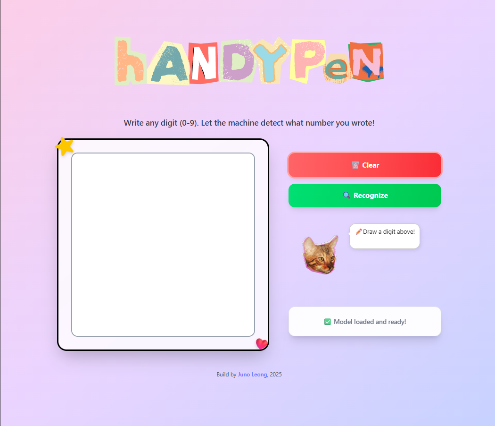
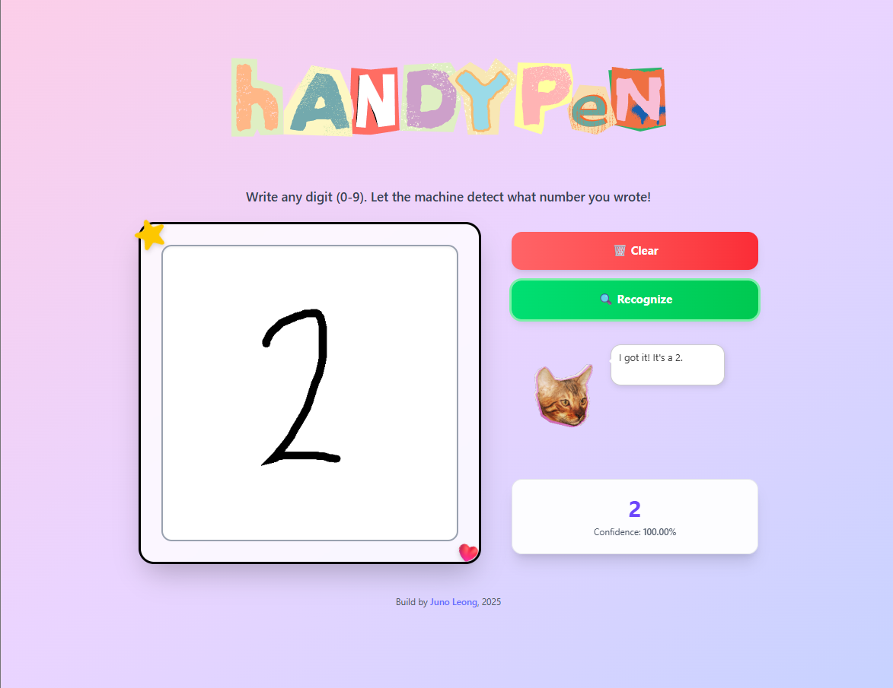
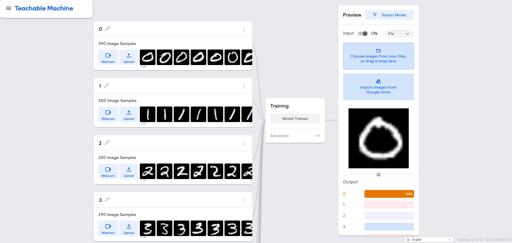

# Digit Recognition Web App

This project is a practice implementation of a digit recognition web application using **Google's Teachable Machine**. The app allows users to draw a digit, and it uses a trained model to recognize the digit in real-time.

Built with **Vite，React, JavaScript, and TailwindCSS**, this project also involves preprocessing the MNIST dataset to train a custom model.

> 🟢 The HandyPen is now live on Vercel!  
> 👉 [Try it here](https://digit-recognition-three.vercel.app/)  





---

## 🚀 Tech Stack
- Frontend: React + Vite

- Styling: CSS / Tailwind CSS

- ML Model: [Google's Teachable Machine](https://teachablemachine.withgoogle.com)  

- Tools: Node.js, NPM, nvm
  
## 🧾 Teachable Machine Model
The machine learning model was created using Teachable Machine.
- 🔗**Model URL:** https://teachablemachine.withgoogle.com/models/fWaCH2zzy



---
### 🧾 MNIST Dataset Preprocessing
To train the model or understand how the dataset works:

1. **Download the MNIST dataset** from [Kaggle](https://www.kaggle.com/datasets/marvinluckianto/mnist-dataset?resource=download) 

2. **Install dependencies** for preprocessing:
    ```
    pip install numpy Pillow
    ```

3. Convert dataset and save into folder
    ```
    python convert_mnist.py
    ```

## 📦 Local Development Setup
1. Clone the repository
   
2. Install dependencies
   ```
   npm install
    ```
3. Run the development server
   >Make sure you're using the correct version of Node.js. If using nvm:
   ```
   nvm use 24 #or whichever version you prefer
   ```
   Then start the app:
   ```
   npm run dev
    ```

---
## ✅ Features
- 🎨 Draw digits directly in the browser
- 🔍 Real-time digit recognition with ML model
- 🧼 Clear canvas functionality
- 💬 Cute feedback bubble
- ⚙️ Model loading status and error handling
- 📱 Fully responsive layout

---
Feel free to reach out with suggestions or improvements for the project! If you like or are using this project, please consider giving it a star⭐. Thanks! (●'◡'●)